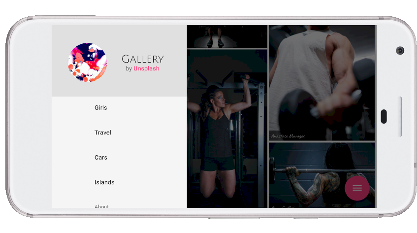
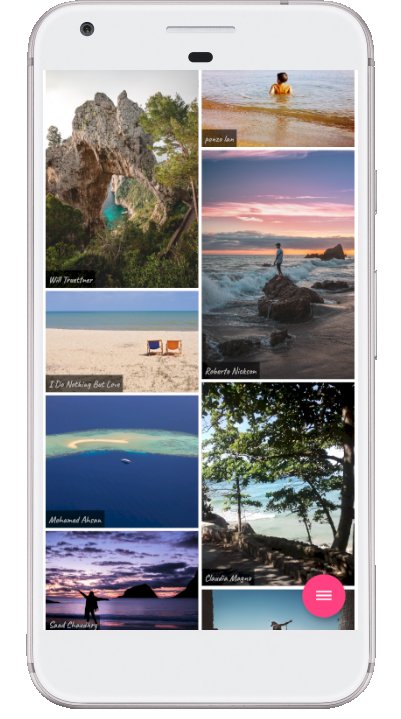

# Gallery Unsplash using Flutter/Dart

Gallery Unsplash client - shows beautiful, high-quality photos from the Unsplash images provider.

- created with Flutter/Dart
- for portfolio/educational purposes 
- works with the Unsplash API with possible limitations
- compatible with Android, iOS, Web, MacOS, Linux

Web [maxeema.github.io/gallery](https://maxeema.github.io/gallery)

Android [play.google.com/store/apps/details?id=maxeem.america.gallery](https://play.google.com/store/apps/details?id=maxeem.america.gallery)

 

 

 

© Max Shemetov, 2020
